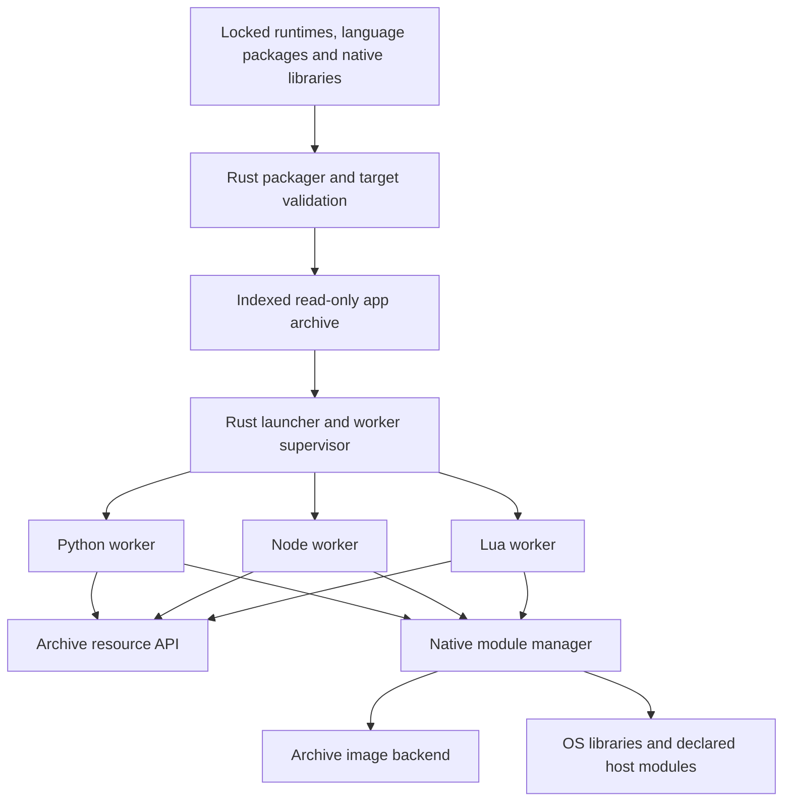

**glue_rs — implementation and agent handoff plan**

Prepared 8 October 2026. Status: researched design; no runtime or loader has been implemented or tested. The workspace was empty when this plan was written. Proposed commands, interfaces, paths, and milestones below are specifications for future work.

Build a Rust application packager and launcher that runs Python, Node.js, and Lua code from one read-only archive, including supported native extensions and their bundled dependencies, without extracting payloads into a filesystem. Support Linux, macOS, Windows, and FreeBSD through explicit target profiles. This is a runtime and toolchain project; native-loader compatibility is the critical path.

**1. Agreed contract and scope**

The user explicitly permits linking against built-in OS libraries and choosing either a bundled language runtime or a compatible host runtime. Statically link the Rust launcher and its own Rust dependencies where supported. Runtime provisioning is a per-runtime manifest choice: `bundled` includes the selected runtime and its dependencies; `host` declares an existing compatible installation as a prerequisite. Bundled mode is the default for self-contained distribution and requires no installed Python, Node or Lua. Neither mode requires an installed compiler, package manager, daemon, driver, FUSE implementation, or container engine. List all external dependencies, distinguishing OS libraries from explicitly selected host runtimes. Apple documents why fully static system executables are unsupported; the accepted system-library exception resolves that requirement conflict. [Apple QA1118](https://developer.apple.com/library/archive/qa/qa1118/_index.html)

Python's preferred bundled provider is Astral's `python-build-standalone` (PBS), the prebuilt distributions used by uv. Accept pinned upstream archives and runtime trees installed by uv on the build machine; uv itself is an optional build-time tool and is never a deployment dependency. A `host` Python provider loads a compatible installed Python shared library and uses that installation's matching standard library. Provider choice is explicit, with no silent host fallback or runtime download. Apply the same provisioning model to Lua and Node, and preserve it for a future Julia adapter. [uv CPython distributions](https://docs.astral.sh/uv/concepts/python-versions/#cpython-distributions)

The runtime must not create temporary payload files, including files later unlinked, user-cache extractions, `/tmp`, `$TMPDIR`, `%TEMP%`, or a substitute directory. No disk-backed `O_TMPFILE`, mounted RAM disk, or FUSE workaround. Decompressing bytes into memory is allowed. Proposed interpretation: anonymous kernel memory objects such as Linux `memfd` and FreeBSD anonymous shared memory are allowed because they require no extraction into a filesystem directory. Record their use explicitly; offer a direct-memory backend where proven. This is a no-payload-materialization guarantee, not a promise that the OS never swaps memory or writes a crash dump.

Build-time tools may use ordinary files and installed toolchains. Runtime package installation, compilation, downloading, and dependency discovery that fetches missing components are excluded. Applications can use normal host I/O for their own work; accessing an archived resource must never silently turn into extraction. Code that itself insists on temporary files needs adaptation to satisfy the contract.

Deliver two forms: `glue run app.glue` with a relocatable launcher-plus-archive pair, and `glue build --standalone` producing one executable containing the same archive. The standalone executable remains an OS/architecture-specific artifact. An archive may contain several target slices; that does not make an ELF executable runnable on Windows or macOS.

“Mixed languages” means a single app can invoke components in all three runtimes and exchange results during one execution. The first implementation uses workers re-executing the same launcher with different entry points and communicating over anonymous pipes. No separate installed executables, listening network service, or filesystem socket is required. Same-process cross-language calls are a later optimization. Worker processes do not provide a security sandbox; the app runs with the user's permissions.

“Native modules supported” must always identify the tested binary/ABI feature profile. There is no blanket claim that arbitrary existing wheels, `.node` addons, Lua modules, or libraries work unchanged. In particular, a native component may require a real pathname, OS loader registration, its own runtime, a helper executable, or platform facilities that an archive cannot provide. Unsupported cases must fail with a useful diagnostic, never trigger extraction.

**2. Feasibility findings that shape the design**

PyOxidizer is a useful model for resource import and embedding. Its documented in-memory shared-library support is restricted to particular Windows distributions, with compatibility caveats; its static musl Python distributions only support built-in extensions. It is not evidence of a portable native loader. Reuse concepts and evaluate maintained components individually. [PyOxidizer extension-module documentation](https://pyoxidizer.readthedocs.io/en/stable/pyoxidizer_packaging_extension_modules.html)

Node's current documentation describes SEA virtual filesystem support, including modules and ZIP assets, added in v26.9.0. Native `.node` loading from that VFS still requires a real file and its documented workaround extracts to a temporary file. Evaluate that VFS for reuse in the chosen embedded Node version, while replacing the native-addon path. A current documentation feature must not be assumed present in an older LTS runtime. [Node SEA documentation](https://nodejs.org/api/single-executable-applications.html)

PackageCompiler's app output is a bundle of files, and its library output is relocatable. Julia therefore remains a possible future runtime adapter, not an already solved archive-loading backend. [PackageCompiler project](https://github.com/JuliaLang/PackageCompiler.jl)

PBS provides redistributable runtime files. Its full archives include `PYTHON.json` metadata and build artifacts; install-only archives omit those extras, and stripped variants also omit debug symbols. Shared-library availability depends on the chosen distribution. Inspect and pin the actual artifact rather than assuming every archive supports embedding. These distributions still require our bootstrap, resource and native-loading integration to execute from an archive without extraction. [PBS archive formats](https://docs.astral.sh/python-build-standalone/distributions/)

Upstream PBS currently lists Linux, macOS and Windows. Keep FreeBSD runtime production as a separate work item: supply a compatible bundled CPython build through the same provider interface where no PBS artifact exists. A host-only FreeBSD implementation would not complete the bundled-runtime requirement there. [PBS supported platforms](https://github.com/astral-sh/python-build-standalone)

| Platform | Proposed archive-native backend | What remains to prove |
| --- | --- | --- |
| Linux | Prefer sealed `memfd` objects and the system ELF loader where the dependency graph permits it. Use a Rust ELF mapper for a defined subset when descriptor loading cannot meet the contract. | `/proc/self/fd` availability for path-based `dlopen`; executable-memory policy; dependency names and cycles; symbol versions; runtime exports; TLS; unwind registration. |
| FreeBSD | Prototype anonymous shared memory plus `fdlopen`; retain a separate FreeBSD ELF backend if necessary. | The exact memory-object/loader combination on each selected release, origin-dependent paths, dependencies, TLS and unwind behavior. Linux ELF behavior is not a substitute for these tests. |
| Windows | Rust PE mapper for archived DLLs; OS loading for genuine system dependencies. | PE imports/forwarders, runtime DLL aliases, delay imports, static TLS and thread notifications, exception metadata, activation/resource behavior and process mitigation policies. |
| macOS | Rust Mach-O mapper for a declared native feature subset; dyld for system libraries/frameworks. | Signed deployment and executable-memory policy, fixups, symbol binding, TLV/TLS, unwind metadata, and interaction with Objective-C/Swift and dyld registration. Highest-risk target. |

Linux `memfd_create` creates an anonymous RAM-backed object without a directory entry. Modern kernels expose policy controlling executable memfds. It is a useful backend, not a universal way around loader or OS restrictions. [Linux memfd manual](https://man7.org/linux/man-pages/man2/memfd_create.2.html), [kernel executable-memfd policy](https://docs.kernel.org/userspace-api/mfd_noexec.html)

FreeBSD documents `fdlopen`, and anonymous shared-memory objects are available, but this research has not executed their combination. Treat it as a hypothesis until an executable fixture passes. [FreeBSD loader manual](https://man.freebsd.org/cgi/man.cgi?manpath=FreeBSD+14.4-RELEASE&query=dlclose&sektion=3), [FreeBSD shared-memory manual](https://man.freebsd.org/cgi/man.cgi?apropos=0&manpath=FreeBSD+12.2-RELEASE&query=shm_open&sektion=2)

Do not use `NSCreateObjectFileImageFromMemory` followed by `NSLinkModule` to satisfy the macOS requirement. Apple's published dyld implementation writes the image with `mkstemp`/`pwrite`, loads it, and unlinks the temporary file. Its name is misleading for this purpose. [Apple dyld implementation](https://github.com/apple-oss-distributions/dyld/blob/main/dyld/DyldAPIs.cpp)

On macOS, prove the required entitlements and executable-memory transitions using an actually signed build. V8 and the custom mapper must coordinate executable-memory allocation; an entitlement alone is not a native-loader implementation. Library validation also affects third-party host libraries. Do not depend on users disabling SIP or changing global security settings. [Apple silicon JIT guidance](https://developer.apple.com/documentation/apple-silicon/porting-just-in-time-compilers-to-apple-silicon), [library validation entitlement](https://developer.apple.com/documentation/BundleResources/Entitlements/com.apple.security.cs.disable-library-validation)

Windows provides a documented PE format and exception-table registration APIs, but these do not by themselves provide a general `LoadLibrary` replacement. MemoryModule is useful prior art to inspect; use its behavior as a comparison, not proof of complete TLS or modern Windows compatibility. [PE specification](https://learn.microsoft.com/en-us/windows/win32/debug/pe-format), [RtlAddFunctionTable](https://learn.microsoft.com/en-us/windows/win32/api/winnt/nf-winnt-rtladdfunctiontable), [MemoryModule](https://github.com/fancycode/MemoryModule)

**3. Architecture and shared contracts**

The resource API and native manager are shared Rust code instantiated in each process, not a single address-space loader shared between workers. Each worker acquires its runtime through a provider: load an archived runtime image, load a compatible host shared library, or use an explicitly selected runtime linked into that launcher build. The provider returns one runtime identity and the API exports needed by the language adapter. Start with these ownership boundaries; merge crates later if separate crates do not help:

| Proposed crate/path | Responsibility |
| --- | --- |
| `crates/glue-format` | Versioned manifest, target/ABI descriptors, archive reader/writer, content identities. |
| `crates/glue-resources` | Read-only resource tree, positional reads, streams, metadata, memory decompression cache. |
| `crates/glue-native` | Dependency graph, module identity, scopes, runtime exports, symbol leases, host/archived routing. |
| `crates/glue-native-{elf,pe,macho}` | Format/platform mapping and relocation; Linux and FreeBSD remain distinct ELF implementations where ABI behavior differs. |
| `crates/glue-runtime-{python,node,lua}` | Bundled/host runtime providers, API binding, interpreter initialization, imports, native-load hooks, lifecycle and diagnostics. |
| `crates/glue-runner` | CLI, worker spawning, IPC, exit/signal handling, standalone archive discovery. |
| `crates/glue-pack` | Build-time dependency closure, package adapters, transformations, validation and reports. |
| `fixtures/`, `tests/`, `docs/decisions/` | Native ABI corpus, packaged apps, platform evidence and design decisions. |

Freeze a small common API before independent implementation: `Archive::open(source)`, `Resources::{stat,list,read_at,open}`, `NativeLoader::load(module_id, scope)`, `ModuleHandle::lookup(symbol)`, `RuntimeProvider::acquire(spec)`, and `Runtime::{start,invoke,stop}`. These names are design sketches, not a stable Rust ABI. Native calls across runtime shims use a versioned C ABI with explicit ownership, buffer length, error and thread rules. Rust traits stay within the build. Python's provider binds a version-checked table of function and data exports; the generic launcher must not have an accidental link-time dependency on a developer's `libpython`. Keep the provider's module handle alive for every API call and extension using it.

`ModuleHandle` owns the image and dependency references. A resolved symbol cannot outlive its module. Initially pin native images for the process lifetime; implement logical close without unmapping executable pages. Avoid promising arbitrary unload/reload, especially with background threads and callbacks. Track loading/ready/failed states, constructor ordering and reentrant initialization. A failed partial load must never publish callable symbols.

All new orchestration, archive code, dependency resolution and loader code should be Rust. Reuse CPython, official Lua and real Node/V8 rather than replacing their semantics. Their upstream C/C++ implementation remains necessary. Keep newly written C/C++ limited to Node's embedding bridge and small boundaries needed to contain C++ exceptions or Lua longjmp; neither may unwind through Rust frames. Node's embedding API can change at major releases, so pin its source and bridge together. [Node embedding API](https://nodejs.org/api/embedding.html)

**4. Archive, packaging and size policy**

Begin with a versioned manifest plus a seekable ZIP64 payload restricted to stored/deflate entries, provided the Node reuse spike confirms it is a useful common denominator. Wrap it with a small locator and manifest identity rather than inventing a new compression/container format. If benchmarks justify another format, change the payload backend behind `Resources` before freezing version 1. Require bounded decompression and random access; do not decompress the entire app at startup. Deflate does not give cheap arbitrary seeks within one compressed member: cache bounded decompressed entries and store large seek-heavy resources uncompressed or in independently indexed chunks.

The manifest records entry points and workers, resource paths and hashes, native module identities and dependencies, target slices, minimum OS/CPU requirements, libc family/version floor, language-runtime build IDs, CPython ABI/GIL mode, Node addon ABI or Node-API version, Lua version/configuration, required loader features, and declared host imports. Each runtime spec adds provisioning mode, provider, version constraint, runtime-library/stdlib identity and host discovery policy. The build lock records the exact bundled release, target, variant, source artifact and digest; resolve a uv-managed tree to its actual version instead of retaining a moving installation symlink. Keep payload hashes distinct from compressed-byte hashes where transformations require both. Resource paths have one canonical representation; reject traversal, duplicates, case collisions and escaping symlinks.

A target profile includes OS, architecture, minimum OS, page-size assumptions and ABI. Initial release targets should include Linux x86_64/glibc, macOS arm64, Windows x86_64/MSVC and FreeBSD amd64. Develop Linux arm64 and other architectures as separate cells; no “all architectures” implication. Freeze exact minimum versions and runtime source revisions after the platform probes. A musl build is a separate compatibility profile, not a glibc-wheel runtime.

Build-time adapters consume locked pip/npm/LuaRocks outputs plus explicit assets. Package installation happens only on the builder. Detect native dependencies from ELF/Mach-O/PE metadata without executing an untrusted library just to inspect it. Permit explicit declarations for runtime-computed imports, plugins and resource paths. Static inspection and traced sample runs cannot prove an arbitrary program's complete dependency closure.

For bundled Python, prefer ingesting an existing PBS shared runtime: include `libpython`/the Python DLL, its matching standard library, selected stdlib native modules, application packages and non-system dependencies. The Rust worker loads the runtime image and initializes it through the embedding API; it does not try to execute an archived `python` executable. Runtime loading and early startup are mandatory feasibility gates. A linked-runtime build remains an explicit alternative where useful, such as Lua, rather than the default assumption for Python. Bundled mode leaves only approved OS dependencies outside the archive; host mode additionally declares its runtime dependency.

At build time, normalize the chosen PBS artifact into our archive layout. Use the full distribution's metadata when available. For install-only inputs or uv-managed trees, obtain matching upstream metadata or derive and validate the equivalent inventory; do not assume `PYTHON.json` survived installation. Record any image or resource transformations. Cross-target ingestion must inspect target files without executing them on the wrong host. Prefer consuming upstream runtime binaries unchanged, with adaptation in the launcher, loader and resource layer. Any need to patch/rebuild CPython is a separately identified custom provider and a reported limitation of stock-PBS support.

Audit common dependencies such as OpenSSL, zlib, C++ runtimes and allocators. Worker separation isolates runtime state, but cannot fix duplicate or incompatible symbols already linked into the same executable. Unify compatible dependency builds, hide/prefix private symbols, or use independently mapped runtime images with an explicit ABI boundary. Do not mix two libc implementations or transfer allocations between incompatible allocators. A library qualifies as a system dependency only when the selected OS baseline guarantees it; bundle toolchain redistributables and other dependencies that would otherwise require host installation.

Default to preserving declared package contents. Offer opt-in pruning with reports for unused runtimes, tests, development files, debug symbols, locale/ICU data and optional standard-library features. Dynamic imports make aggressive reachability trimming unsafe as a default. Node/V8 and a scientific Python stack will still dominate some bundles; measure actual bytes rather than promise an arbitrary small executable.

Produce `glue inspect`, `glue explain-size`, `glue doctor`, a dependency/host-requirement report, and license/source notices. Reproducibility includes sorted inputs, normalized archive metadata, pinned runtimes/toolchains and an unsigned payload hash; signing timestamps may prevent identical final executable bytes.

For standalone builds, place the archive in an OS-appropriate executable section/resource or a verified supported layout before signing. Re-sign after content changes. The locator must survive signing, including PE certificate-table changes; do not assume the archive footer remains at end-of-file. Validate macOS code signing/notarization and Windows signing against the final packaged layout.

**5. Native loading and host interoperability**

Resolve a dependency to an explicit class: an archived library, an export supplied by the embedded runtime, an approved OS library, or a declared host module. Key identities by target, namespace and content/build identity, not basename alone. Provide deterministic resolution and errors naming the requesting module, missing dependency/symbol, ABI or unsupported relocation.

Do not blindly prefer archive libraries over system libraries with the same name. Pin each dependency edge at build time where possible, and validate remaining host requirements at startup. Use native OS loaders for actual system libraries; keep their ordinary loader-owned handles separate from custom-mapped handles. Specify function and data exports, symbol versions, weak symbols and scope rules.

Host-resident Python/Lua/Node extensions are not necessarily system libraries. A host `.pyd` importing `python3xx.dll`, for example, must bind to the exact Python instance selected by the runtime provider, whether bundled or host. The OS loader cannot automatically see a runtime image or alias owned by our mapper. Route such host images through the same custom loader when needed, or reject them with a precise incompatibility. Never instantiate a second CPython to satisfy a dependency accidentally. Establish equivalent rules for `node.exe`/`libnode`, `liblua` and macOS install names. Test both directions: archived extensions using a host runtime, and host extensions using a bundled runtime.

For ELF descriptor loading, archive dependencies do not magically become visible to `DT_NEEDED`, `$ORIGIN`, `RPATH` or later `dlopen` calls. Prototype dependency-ordered loading with verified SONAME identities; examine build-time normalization or reserved dependency-name slots for descriptor paths when necessary. Cycles, absolute dependency names and conflicting versions need explicit tests or a documented unsupported result. Retain descriptors for the complete image lifetime. Compare symbol scope and TLS against an ordinary disk-loaded reference fixture. [Linux dynamic-loader semantics](https://man7.org/linux/man-pages/man3/dlopen.3.html)

A custom ELF mapper needs segment mapping/zero-fill, supported relocations, GOT/PLT behavior, versioned symbols, constructors/destructors, RELRO, thread-local storage, unwind metadata and any declared IFUNC support. Linux and FreeBSD have distinct TLS and loader interactions. Begin with a narrow C ABI profile; dynamic TLS on threads created outside the launcher is an explicit expansion gate. Do not claim musl-static plus arbitrary glibc modules works because both use ELF.

A PE mapper needs mapped sections, base relocations, named/ordinal imports, forwarded exports/API sets, supported delay imports, runtime aliases, final protections and instruction-cache synchronization. Test exception-table registration, CRT initialization, TLS template allocation and notifications on existing/new threads. Running TLS callbacks once is insufficient. Pin modules initially; handle process mitigation incompatibilities by reporting them. Do not rely on undocumented PEB/loader-list mutation as the supported design. [Microsoft TLS guidance](https://learn.microsoft.com/en-us/windows/win32/dlls/using-thread-local-storage-in-a-dynamic-link-library), [DllMain lifecycle](https://learn.microsoft.com/en-us/windows/win32/dlls/dllmain)

A Mach-O mapper needs segment/section mapping, rebases, supported bind/chained-fixup formats, exports, library ordinals, weak/re-export behavior, initializers and final protections. TLV/TLS, unwind discovery, dyld image introspection, Objective-C/Swift registration and authenticated-pointer formats are separate capabilities. Start with C-compatible arm64 images and reject unsupported metadata before running constructors. Investigate public mechanisms first; if a required capability depends on unstable private APIs, record that as a release blocker for that profile.

Intercept runtime entry points that load native code: Python imports and `ctypes`, Lua native searchers and `package.loadlib`, and Node `process.dlopen`. CFFI and native code's nested `dlopen`/`LoadLibrary` calls require their own conformance fixtures. Supported archive images may bind imported loader calls to our resolver, but this does not transparently intercept calls made inside arbitrary host libraries or direct syscalls. Record that boundary rather than claiming process-wide virtualization.

**6. Language adapters and resource behavior**

Python: pin one CPython minor version and conventional GIL mode initially. Implement both the PBS bundled provider and the host provider against the same adapter. Validate architecture, runtime version/ABI, GIL/debug mode, shared-library exports and extension compatibility before initialization. A host executable alone does not prove a usable shared embedding library exists; diagnose unsupported installations. Pair a host library with its own standard library, and isolate application package search paths from host user/site packages unless explicitly declared.

Initialize using CPython's isolated configuration, with environment/user-site leakage and bytecode-cache writes disabled. In bundled mode, bootstrap the importer before imports needed for interpreter startup; include codecs/encodings and required built-ins from the selected runtime. Prove this ordering with the actual PBS library and no on-disk Python home. Implement module/package/namespace resolution, source/bytecode identity, metadata and stream-based resources. [CPython initialization](https://docs.python.org/3/c-api/init_config.html)

Native Python initialization must preserve both supported single-phase and multi-phase extension behavior; finding `PyInit_*` and calling it is not the whole import protocol. First implement an archive importer and extension-init bridge using the selected runtime's supported C APIs, retaining import caching, module specs, creation and execution semantics. Evaluate loader-call binding in mapped images where needed. The stock PBS/host providers must not depend on a private hook available only in a patched interpreter. If a feature needs such a hook, mark that provider/feature blocked or introduce an explicitly custom runtime variant. Include ABI checks and exported runtime data symbols. [CPython extension-module initialization](https://docs.python.org/3/c-api/extension-modules.html)

Virtual `__file__`/origin values are diagnostic identities, not OS paths. Support `importlib.resources` reads. Its `as_file` helper can extract resources, so archive objects must reject materialization and provide an actionable stream/buffer alternative. Python's native `open`, `os.open`, `mmap`, C `fopen`, and third-party path consumers do not become archive-aware just because imports work. Patch/adapt selected APIs/packages; report path-required packages as incompatible until tested. [Python resource API](https://docs.python.org/3/library/importlib.resources.html)

Node: embed real Node with its event loop and V8, using a minimal C ABI bridge. Reuse its VFS/module-resolution integration where supported by the pinned version, including CommonJS, ESM, package exports, relative paths and dynamic imports. Wire native addon loading to `glue-native`. Start with Node-API addons; legacy V8/NAN addons remain tied to an exact runtime ABI and need separate validation. Worker threads and subprocess bootstrap need dedicated tests. [Node-API compatibility boundary](https://nodejs.org/api/n-api.html#implications-of-abi-stability)

Lua: begin with official Lua 5.4 and 5.5 using fixed numeric/ABI configuration and explicit version-specific runtime profiles. Install an archive searcher using `package.searchers`, compile/load chunks from buffers, resolve `luaopen_*` through the native manager, and route `package.loadlib` consistently. Use Lua source as the portable payload; bytecode is a version/target-specific optimization. Adapt `loadfile`/`dofile` and resource reads without changing ordinary host I/O accidentally. LuaJIT is a later distinct runtime. [Lua 5.4 manual](https://www.lua.org/manual/5.4/manual.html#6.3), [Lua 5.5 manual](https://www.lua.org/manual/5.5/manual.html#6.3)

Use a resource API with file-like streams/positional reads, metadata and directory enumeration. There is no mount and no universal syscall interception. Supporting a language's high-level file APIs is separate from handing a real file descriptor to a native library. An API demanding a real on-disk pathname must be adapted or rejected. Tests must expose this distinction.

**7. Mixed-language execution**

The Rust supervisor starts only the required workers by re-executing the same launcher file; each worker acquires and initializes only its selected runtime/provider. Pass archive identity, provider selection, entry point and explicitly inherited read-only descriptors/handles. For separate archives, pin/verify their identity across workers. A host-mode worker loads the declared host runtime library; it still uses the same launcher/bootstrap protocol. Keep protocol handles separate from application stdout/stderr and normal stdin.

Use a versioned, length-delimited message protocol over anonymous pipes. Start with null, booleans, signed integers, floats, UTF-8 strings, bytes, lists and string-keyed maps. Define integer range/overflow across JavaScript Number and Python integers; support tagged 64-bit values explicitly. Include request IDs, errors, deadlines, cancellation, backpressure, worker shutdown and crash propagation. Do not pass borrowed runtime objects or raw pointers across runtimes.

Expose a small `glue.call(component, method, args)` API in each language, with an async form for Node. The acceptance app must make calls across all three languages during one run, return values, propagate an error and cancel a pending call. It is not sufficient to offer three alternative entry points that never interact.

Re-execution provides a portable path for runtime workers; it does not enable execution of arbitrary archived helper EXEs on Windows/macOS. Diagnose packages requiring external helper programs. Implement Python multiprocessing spawn and Node child/worker bootstrap as explicit follow-up capabilities using launcher dispatch where feasible. Do not fork an already multithreaded mixed-runtime process as the baseline.

Same-process embedding can later reduce RPC overhead for proven combinations. It requires runtime thread-affinity, GIL, event-loop, signals, memory ownership, reentrancy and incompatible-library decisions. It is not a prerequisite for the first mixed-language app.

**8. Ordered milestones and acceptance gates**

| Gate | Deliverable | Pass condition |
| --- | --- | --- |
| G0 — contract and toolchain | Target profiles, runtime-provider specs and pins, host-library policy, fixture definitions and signed macOS deployment experiment. | No unresolved interpretation of payload extraction; every platform has a runtime source and explicit feature matrix, including FreeBSD's bundled Python producer. |
| G1 — platform feasibility | Tiny archive image loading on all four OSes, actual PBS runtime bootstrap on its supported targets, host-Python embedding, and basic Lua/Node embedding. | A native module calls one archived dependency and one actual OS dependency without payload writes. Bundled Python starts and imports `encodings`, `math` and `_ssl` without an installed Python home. Host mode starts the same app with a validated installed runtime. macOS succeeds with the intended signing policy; FreeBSD actually runs its bundled Python and Node. |
| G2 — usable package core | Versioned archive, resources, CLI and Lua vertical slice. | Pure Lua and a native Lua module run after relocation on a clean host; malformed/unsupported archives fail before execution. |
| G3 — runtime coverage | Python and Node adapters, provider integration, native resolver and export tables. | Each language imports source, reads assets, loads an archived extension and a compatible host module, and propagates errors. Python passes these cases with both a bundled PBS runtime and a compatible host runtime, without mixing runtime identities. |
| G4 — mixed app | Worker supervisor and language bindings. | A single archive executes an end-to-end Python/Node/Lua workflow over anonymous pipes with deterministic shutdown and no extraction. |
| G5 — native compatibility | Published loader capability matrix and representative real packages. | All native features required by the frozen release profile pass their fixtures and real-package tests. Optional unsupported binary features are rejected before partial execution. |
| G6 — distribution | Standalone executable packaging, signing, clean-host CI, size reports and release documentation. | Every advertised target passes relocation, offline startup and no-payload-write tests. Bundled mode runs without installed language runtimes; host mode succeeds with declared prerequisites and diagnoses a missing/incompatible runtime. |

G1 is a decision gate, not a promise that all of G5 is feasible. If macOS cannot meet the chosen native profile with a shippable policy, report that exact failure and retain the no-extraction constraint. Alternatives such as statically rebuilding particular extensions satisfy a narrower profile; they do not establish general shared-library loading. A Linux-only prototype does not satisfy the four-platform delivery requirement. Freeze required versus optional native features with the representative package corpus after G1; a failed required feature blocks release and cannot simply be reclassified to make G5 pass.

Include FreeBSD early: current upstream Node build documentation marks FreeBSD x64 experimental, so this project needs its own build and test ownership there. Freeze the chosen Node branch and check that branch's matrix, rather than relying forever on `main`. [Node platform support](https://github.com/nodejs/node/blob/main/BUILDING.md#platform-list)

**9. Work packages ready to assign to agents**

Each assignment must return its changes, reproducible commands, observed target/toolchain, tests and traces, supported/unsupported feature matrix, and unresolved decisions. No assignment may silently relax the no-extraction rule, change the manifest/ABI contract, or label a smoke test “general compatibility.” Cross-owner API changes require a small decision record. Future paths below establish ownership; there is no existing implementation to preserve.

| ID / owner | Assignment and owned paths | Dependencies and completion evidence |
| --- | --- | --- |
| A0 / integration | Freeze contracts, runtime-provider API, target/runtime pins and fixture protocol; own `docs/decisions`, root build configuration and common API review. | First. Specify bundled/host selection and the FreeBSD Python source. Publish contracts and test expectations; resolve proposed deviations before dependent work. |
| A1 / macOS feasibility | Own Mach-O spike/backend and macOS fixtures. Prove signed arm64 code mapping, archived/host dependencies, then TLV/unwind boundaries; trace hidden writes. | Starts after A0, before broad runtime work. Produce executable evidence and a go/no-go assessment; no `NSLinkModule` extraction path. |
| A2 / Windows feasibility | Own PE spike/backend and Windows fixtures. Prove imports, runtime aliases, native API calls, then TLS and exception cases. | Starts after A0. Compare with normal OS loading; explicitly test host `.pyd`/addon identity against the embedded runtime. |
| A3 / ELF feasibility | Own Linux/FreeBSD backends and ELF fixtures. Probe memfd/fdlopen routes, dependency closure, exports and ABI differences. | Starts after A0. Real execution evidence on both OSes; split into separate platform agents if useful. |
| A4 / archive and resources | Own `glue-format`, `glue-resources`, corruption tests and resource fixtures. | Depends on A0; can proceed during platform spikes using synthetic payloads. Deterministic round trips, positional reads and bounded decoding. |
| A5 / native coordinator | Own `glue-native`, dependency graph, scopes, export registry and feature validation. | Depends on A0 and findings from A1–A3. Integrate real platform backends; missing dependencies and cycles cannot masquerade as success. |
| A6 / Lua | Own Lua adapter and Lua fixtures. Implement source imports, assets and native loading with correct error boundaries. | A4/A5; begin against agreed test interfaces. First complete vertical slice with a real native backend. |
| A7 / Python | Own PBS ingestion/provider integration, host provider, API binding, importer/init bridge and Python fixtures; coordinate FreeBSD runtime production. | G1 proves actual prebuilt-runtime bootstrap and host embedding. Full integration after A4/A5; test stdlib startup, resources, multi-phase extensions and all bundled/host runtime-extension combinations. A patched interpreter cannot substitute for stock-PBS acceptance. |
| A8 / Node | Own Node build recipe, C++ bridge, VFS evaluation, addon hook and Node fixtures. | G1 includes FreeBSD build/run and embedding viability. Full integration after A4/A5; test CJS, ESM, Node-API and V8 JIT/signing together. |
| A9 / runner and IPC | Own `glue-runner`, message schema, worker lifecycle and cross-language integration fixture. | A0/A4; use synthetic workers first, then A6–A8. End-to-end three-language result, error, cancellation and crash tests. |
| A10 / packaging and release | Own `glue-pack`, lockfile/PBS artifact adapters, standalone layout and target CI. | Coordinate runtime inventory with A7. Release waits for G1–G5 evidence. Pin PBS release/digest, validate uv-tree ingestion, publish external requirements and test bundled/host profiles separately. |

Recommended dispatch: first A0, then the three platform feasibility assignments concurrently. Run A4 alongside them if capacity allows. Freeze the resulting native capability contract before spreading work over A5–A9. Keep A10 responsible for final evidence on every target; platform owners review their respective release artifacts. These are handoff assignments, not agents already launched.

**10. Conformance corpus and definition of done**

Create minimal fixtures with known behavior before trying large ecosystems. Use Rust for ordinary fixture libraries, plus small C/C++ fixtures where compiler-emitted TLS, exceptions, constructors or exact runtime ABIs must be exercised. They are necessary test inputs, not additional implementation languages for the product.

| Area | Required evidence |
| --- | --- |
| Native basics | Function and data exports, archived dependency chain, real OS dependency, repeated imports, weak/missing symbols, dependency cycle, wrong architecture and unsupported relocation. |
| Threads/lifecycle | Constructors once, reentrant loading, TLS on existing/new threads and library-created threads, callbacks, process-lifetime pinning, initialization failure. |
| Exceptions/runtime identity | Supported unwind cases, no exceptions crossing Rust FFI, host/native runtime aliases and allocator ownership. |
| Language imports | CPython startup and packages, Lua searchers, Node CJS/ESM/package exports, all three native-module types, nested loading and dynamic import declarations. |
| Runtime providers | The same Python app runs with pinned PBS and with a compatible host Python. Exercise bundled/host runtime crossed with archived/host extension location; reject ABI mismatch or missing shared runtime. Prove full-archive and install-only/uv-tree ingestion, no uv dependency at execution, and no silent provider fallback. |
| Resource compatibility | Stream reads, seek/stat/list, virtual origin reporting, path-only consumers, `as_file` rejection and explicit write errors on archived paths. |
| Mixed execution | Python, Node and Lua participate in one app; bytes and numeric edge cases round-trip; error/cancel/crash and concurrent calls terminate correctly. |
| Distribution | Copy/rename app into a different path including spaces/non-ASCII; bundled mode with no runtimes installed, host mode with only declared prerequisites; empty user home, arbitrary working directory, offline startup; final code signature remains valid. |
| Extraction prohibition | Trace the app and descendants, including failed open/create/unlink attempts. No payload/cache/temp materialization anywhere, and no fallback after a denied operation. |
| Robustness and cost | Fuzz archive and native metadata parsers; malformed/oversized inputs fail predictably. Measure compressed size, startup, steady/peak memory, descriptor count and worker overhead. |

Use native OS runners for execution, especially Windows, macOS arm64 and FreeBSD; cross-compilation is not execution evidence. Instrumented CI may use tracing tools that are not required on deployment hosts. Suitable starting points are Linux syscall tracing, FreeBSD ktrace, macOS filesystem/VM tracing, and Windows file/image event tracing. Select a method that actually observes the signed app on the target OS; a clean directory listing after exit will miss create-then-unlink extraction.

“No extraction” does not prohibit reading the original executable/archive or approved host libraries. Tests must distinguish these reads, ordinary application output, anonymous-memory operations and payload writes. Include inaccessible temporary directories and disabled disk caches as additional checks, not substitutes for traces.

After minimal fixtures, choose and pin one real C extension, one dependency-heavy Python package, one Node-API addon with a secondary library, and one native Lua package available for each target. Evaluate a scientific Python package as an expansion stress test, not as evidence implied by a trivial extension. Publish exact package versions and operations exercised, plus known unsupported cases.

Set quantitative size/startup/memory budgets from measured empty-launcher, Lua-only, Python-only, Node-only and mixed-app baselines. Report the largest contributors and regression thresholds. Do not trade silent resource removal or runtime compatibility for a headline archive size.

The first release is complete only when the documented supported profile works on all four OSes, both archived and declared host native loading are demonstrated, and a mixed-language app executes from one archive. Bundled distributions run without an installed language runtime, including Python sourced from PBS where available and an equivalent bundled build on FreeBSD. Python also supports an explicitly selected compatible host runtime. Neither mode extracts payloads, and neither silently substitutes a different runtime provider. Wider ABI/package coverage is continuing work with explicit gates. Estimate production effort after the platform probes; the custom loader and compatibility corpus should determine the schedule.
